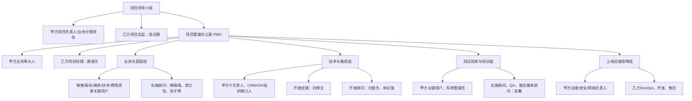

# 西域数智化投标管理平台建设项目启动会

> 版本：启动会客户汇报版
> 建议汇报日期：2026年4月27日
> 汇报人：唐诵文
> 排期口径：按有效工作日编排，周六/周日及国家法定节假日不计入阶段工期。2026年4月27日至2026年7月23日共计60个有效工作日；已避开劳动节假期（2026-05-01至2026-05-05）与端午节假期（2026-06-19至2026-06-21）。节假日依据[国务院办公厅2026年部分节假日安排](https://www.gov.cn/gongbao/2025/issue_12406/202511/content_7048922.html)；按客户协同稳健口径，周六/周日均不排关键任务，未将2026-05-09调休周六计入项目有效工作日。

---

## 01 项目目标

### 西域数智化投标管理平台建设项目目标

本项目以“投标业务全生命周期数智化管理”为核心，围绕商机/标讯获取、项目立项、任务协同、标书编制、资源管理、投标提交、结果闭环和知识沉淀，建设统一的数智化投标管理平台，形成“流程在线、协同高效、风险可控、知识复用、决策有据”的投标管理新体系。

**总体目标：**

1. **全流程闭环**：打通商机/标讯、项目立项、任务协同、标书编制、投标提交、中标结果、案例沉淀的端到端流程。
2. **协同效率提升**：建立角色化工作台、任务看板、交付物管理、提醒预警和协作讨论机制，减少跨部门沟通断点。
3. **资源统一管理**：围绕资质、案例、模板、平台账户、BAR证书、合同借阅、费用和保证金等投标资源，形成可查、可用、可追溯的统一台账。
4. **风险前置控制**：通过AI合规检查、评分覆盖分析、资质有效期提醒、截标提醒和关键节点预警，降低漏项、错项和废标风险。
5. **数据驱动决策**：汇聚项目、客户、区域、产品线、费用、结果、竞对和知识资产数据，支撑中标率、ROI、竞争态势和资源投入分析。

**建设后的核心变化：**

| 当前痛点 | 建设后状态 | 管理价值 |
| --- | --- | --- |
| 标讯、项目、费用、资料分散管理 | 全流程统一入口、统一台账、统一状态 | 降低协同成本，减少信息断点 |
| 投标过程依赖个人经验 | 规则、模板、案例、AI建议统一沉淀 | 提升复用效率和过程稳定性 |
| 费用与投标资源事后统计 | 费用、保证金、账户、证书过程跟踪 | 资源占用清晰、责任可追溯 |
| 管理层难以及时掌握投标质量 | 驾驶舱、趋势分析、ROI、竞对分析可视化 | 支撑经营决策和资源配置 |

### 技术手段对投标管理的现在与未来

本项目不是单纯建设一个台账系统，而是把投标管理从“人工跟进、经验驱动、线下协同”逐步升级为“流程驱动、智能辅助、数据决策”的数字化管理模式。

**现阶段重点：把投标全过程搬到线上**

1. 标讯、项目、任务、文档、费用、结果统一到同一套业务主链路，减少信息散落。
2. 通过任务看板、交付物、版本记录和协作讨论，让投标过程可分工、可跟踪、可复盘。
3. 通过资质库、案例库、模板库和BAR资源台账，让投标资料和关键资源可复用、可追溯。
4. 通过费用、保证金、账户、证书与项目关联，形成投标资源投入的完整过程记录。
5. 通过权限、审计日志、提醒预警和问题闭环，提升管理规范性和风险响应速度。

**未来演进方向：形成智能投标能力中枢**

1. 与CRM、OA、组织架构、消息通道、电子签章等系统分步打通，实现商机、审批、用印、提醒和组织权限联动。
2. 基于历史项目、客户类型、区域、产品线、中标结果和竞对数据，形成投标机会优先级和资源投入建议。
3. 引入AI辅助招标文件解析、评分点覆盖、合规风险识别、知识推荐和竞争策略建议。
4. 建立“投标项目画像”和“客户/采购方画像”，帮助管理层判断哪些机会值得重点投入。

### 投标业务监控与决策支持

平台围绕“过程监控、结果分析、经营洞察”三层构建管理驾驶舱。

**过程监控：**

- 标讯跟进状态、项目阶段、任务逾期、截标节点、用印/付款/保证金提醒。
- 关键资源状态：平台账户、BAR证书、合同借阅、资质有效期。
- 问题与风险：P0/P1缺陷、接口阻塞、环境准备、UAT问题、上线门禁。

**结果分析：**

- 投标数量、中标率、中标金额、项目周期、费用投入、保证金退还周期。
- 按区域、产品线、客户类型、采购方、项目类型和负责人多维下钻。
- 竞对参与频次、威胁等级、历史结果和策略建议。

**经营决策：**

- ROI分析：项目投入、人天、费用、保证金与预期收益、项目价值关联。
- 商机优先级：通过AI评分、客户价值、历史中标概率和资源占用判断是否重点投入。
- 管理复盘：中标案例、失败原因、评分覆盖、合规风险沉淀为知识资产。

### 数据中台

本期数据中台以“统一数据口径、统一数据服务、统一指标体系”为原则，不追求大而全，而是优先服务投标管理主链路和经营分析场景。

**数据来源层：**

- 标讯/商机数据、客户与采购方数据、项目过程数据、任务与文档数据、费用与保证金数据、账户与证书数据、中标结果与竞对数据。
- 后续预留CRM、OA、组织架构、消息通道、电子签章、第三方标讯服务等接口。

**数据治理层：**

- 统一主数据：组织、用户、角色、客户、项目、资源、费用、模板、资质、案例。
- 统一编码与口径：项目状态、客户类型、区域、行业、费用类型、结果状态、风险等级。
- 统一权限与审计：按角色和数据范围控制访问，关键操作全程留痕。

**数据服务层：**

- 标准REST API服务。
- 管理驾驶舱指标服务。
- 数据下钻和报表导出服务。
- AI分析、知识推荐和风险识别所需的数据服务。

**应用呈现层：**

- 管理驾驶舱、投标分析、ROI分析、竞对分析、客户类型分析、项目看板、资源台账和预警中心。

---

## 02 项目规划

### 项目规划

本项目采用“蓝图先行、分阶段落地、测试门禁、上线受控”的实施策略。原计划按自然日编排为2026-04-27至2026-06-25；本次启动会口径已调整为有效工作日计划，周末和法定节假日不计入项目阶段工期。

**总体计划：60个有效工作日**

| 阶段 | 日期 | 有效工期 | 阶段目标 | 关键里程碑 |
| --- | --- | ---: | --- | --- |
| 第一阶段：项目启动与调研 | 2026-04-27 ~ 2026-05-13 | 10个工作日 | 完成启动宣贯、组织确认、现状调研、范围基线和环境/接口清单 | 启动会召开、实施主计划确认 |
| 第二阶段：蓝图设计与方案确认 | 2026-05-14 ~ 2026-05-25 | 8个工作日 | 完成业务蓝图、权限方案、接口方案、原型和差异分析 | 蓝图评审通过、蓝图确认 |
| 第三阶段：系统实现与配置一期 | 2026-05-26 ~ 2026-06-17 | 17个工作日 | 完成正式范围核心功能适配、开发、配置和内部联调 | 核心功能提测 |
| 第四阶段：集成联调与数据初始化 | 2026-06-18 ~ 2026-07-02 | 10个工作日 | 完成接口联调、基础数据初始化、SIT测试和问题修复 | 集成验证通过 |
| 第五阶段：UAT、培训与上线准备 | 2026-07-03 ~ 2026-07-16 | 10个工作日 | 完成用户验收、培训、上线演练和签字准备 | UAT通过、Go/No-Go评审 |
| 第六阶段：生产上线与试运行启动 | 2026-07-17 ~ 2026-07-23 | 5个工作日 | 完成生产切换、上线验证和试运行保障启动 | 正式上线完成 |

**阶段主线：**

1. **启动与调研**：统一目标、统一组织、统一范围、统一计划。
2. **蓝图确认**：冻结业务流程、权限口径、接口边界、数据口径和原型。
3. **实现配置**：围绕正式版白名单能力完成配置、开发、适配和演示能力隔离。
4. **联调测试**：完成CRM/OA/组织/消息等接口联调，完成数据初始化和SIT。
5. **验收培训**：由甲方关键用户按真实业务场景执行UAT，完成上线演练。
6. **上线试运行**：完成生产发布、健康检查、核心链路验证和试运行支持。

**正式版白名单范围：**

1. 认证与权限：登录认证、会话、角色权限、系统参数、审计日志。
2. 标讯与项目主链路：标讯获取/录入、AI分析、项目立项、任务协同、结果闭环。
3. 知识资产中心：资质库、案例库、模板库及基础检索调用。
4. 资源管理：费用申请/审批/退还、平台账户、BAR证书借还、合同借阅。
5. 协作与文档：文档章节、协作讨论、版本历史、版本比对、回滚查询。
6. 数据分析：管理驾驶舱、多维报表、区域/项目/中标率/投入产出/竞对分析。
7. 系统集成：CRM客户同步、OA审批流、组织架构同步、消息提醒的分步接入。
8. 发布运维：数据库迁移、健康检查、监控指标、上线演练、回滚预案。

---

## 03 项目组织

### 项目组织图

### 项目职责分工

**乙方项目组职责：**

| 角色 | 人员 | 关键职责 |
| --- | --- | --- |
| 项目总监 | 吴远朝 | 高层协调、资源投入保障、重大里程碑签字、质量监控 |
| 项目经理 | 唐诵文 | 总体计划、日常管理、风险控制、周报、例会、客户沟通 |
| 实施顾问 | 韩晴晴 | 业务流程落地、需求适配分析、用户培训、UAT支持 |
| 实施顾问 | 游兰佳 | 资质/案例/模板库配置、表单与权限逻辑验证 |
| 实施顾问 | 张子寒 | 资源管理模块配置、费用/账户/借阅流程适配 |
| 开发经理 | 刘博文 | 技术架构适配、CRM/OA集成方案、AI引擎对接 |
| 开发顾问 | 刘俊杰 | 后端功能定制、接口开发、数据迁移与服务实现 |
| 开发顾问 | 林文强 | 前端页面优化、交互调整、驾驶舱与报表实现 |
| 售后服务顾问 | 高馨 | 生产切换保障、试运行问题受理、运维交接 |

**甲方项目组建议职责：**

| 职能角色 | 建议部门/人员 | 关键职责 |
| --- | --- | --- |
| 项目负责人 | 业务分管领导 | 关键决策、资源协调、阶段确认、重大问题升级 |
| 业务牵头人 | 投标管理部/业务管理部门 | 流程定义、需求优先级、蓝图确认、业务验收 |
| 费用/资源代表 | 商务、费用、资源管理相关人员 | 费用、保证金、账户、证书、合同借阅等流程确认 |
| IT负责人 | 信息技术部 | 环境、网络、安全、账号、域名、证书、接口协调 |
| 关键用户代表 | 销售、商务、技术、费用资源、管理层 | 参与调研、提供样例数据、执行UAT、确认培训效果 |
| 接口系统负责人 | CRM、OA、组织架构、消息平台负责人 | 提供接口资料、测试环境、联调窗口和问题支持 |

---

## 04 项目管理

### 项目管理机制：实施策略

本项目采用“标准产品基线 + 配置落地 + 必要定制 + 受控集成”的实施策略。

1. **正式范围白名单交付**：以双方确认的正式功能清单为准，未闭环能力、演示能力不进入上线范围。
2. **蓝图先行**：流程、权限、数据、接口、原型在蓝图阶段确认，避免开发阶段反复变更。
3. **集成前置**：CRM、OA、组织架构、消息提醒等外部系统在启动阶段即明确接口人、资料和联调窗口。
4. **测试门禁**：开发自测、SIT、UAT、上线演练逐级通过后，方可进入生产切换。
5. **文档闭环**：每阶段形成交付文档、问题清单、确认件和验收证据，作为阶段推进依据。

### 项目管理机制：沟通机制

| 沟通类型 | 频率 | 参与方 | 关注点 | 输出物 |
| --- | --- | --- | --- | --- |
| 项目周例会 | 每周一次 | 双方项目经理、业务牵头人、关键成员 | 进度、风险、问题、下周计划 | 周报、问题清单 |
| 双周管理会 | 每两周一次 | 双方项目负责人、项目总监、项目经理 | 重大决策、资源协调、里程碑确认 | 会议纪要、决策记录 |
| 专题讨论会 | 按需 | 相关业务/技术接口人 | 权限、接口、数据、流程、上线演练 | 专题结论、待办清单 |
| 日报/即时沟通 | 关键阶段每日 | 项目执行成员 | 当日进展、阻塞项、次日计划 | 日报或IM记录 |
| 问题升级 | 按严重级别 | 项目经理、负责人、总监 | P0/P1风险快速决策 | 升级记录、处理方案 |

**问题升级建议：**

- P0：阻塞上线或核心链路不可用，2小时内响应，24小时内形成处理方案。
- P1：影响主流程或验收观感，24小时内响应，明确修复计划和责任人。
- P2：不阻塞上线，纳入迭代清单，明确计划窗口。

### 项目管理机制：质量控制机制

**质量控制原则：**

1. 真实API为唯一正式交付路径，不以Mock或演示数据作为验收依据。
2. 客户环境不暴露“暂未接入”“演示成功”“假动作按钮”等非正式入口。
3. 所有P0问题在进入UAT和上线前必须清零。
4. UAT执行以真实业务场景为依据，保留测试记录、截图、问题闭环和签字结论。
5. 上线前必须完成备份、迁移、部署、健康检查、回滚和生产冒烟验证。

**质量门禁：**

| 阶段 | 门禁要求 |
| --- | --- |
| 蓝图进入开发 | 蓝图、接口、权限、数据口径、原型经双方确认 |
| 开发进入SIT | 正式范围功能可测试，演示入口已隔离，核心缺陷可控 |
| SIT进入UAT | 核心接口通过，基础数据完整，P0问题清零 |
| UAT进入上线 | UAT场景通过，无阻塞上线问题，上线演练通过 |
| 上线完成 | 健康检查通过，主链路验证通过，无高优先级告警 |

### 项目管理机制：实施方法论

本项目按“调研、蓝图、实现、联调、验收、上线、试运行”闭环推进。

1. **调研**：访谈业务、费用资源、IT和管理层，确认现状流程、痛点、样例数据和目标口径。
2. **蓝图**：形成业务流程、角色权限、数据模型、接口方案、原型和差异清单。
3. **实现**：按正式版白名单完成配置、开发、适配、测试和演示能力隔离。
4. **联调**：完成CRM、OA、组织架构、消息提醒、基础数据初始化和SIT。
5. **验收**：组织关键用户按真实场景完成UAT、问题闭环和签字确认。
6. **上线**：执行上线切换、健康检查、生产验证、回滚预案和Go/No-Go评审。
7. **试运行**：不少于3个月的运行跟踪、问题处理、性能优化和运维交接。

### 项目管理机制：阶段里程碑控制

| 里程碑 | 计划日期 | 完成标志 |
| --- | --- | --- |
| 项目启动会 | 2026-04-27 | 双方组织、目标、计划、沟通机制确认 |
| 调研与主计划确认 | 2026-05-13 | 调研清单、风险清单、实施主计划完成 |
| 蓝图确认 | 2026-05-25 | 蓝图文档、接口方案、权限方案、原型确认 |
| 核心功能提测 | 2026-06-17 | 正式范围功能完成内部验证并进入SIT |
| 集成验证通过 | 2026-07-02 | 接口联调、数据初始化、SIT报告完成 |
| UAT通过与上线评审 | 2026-07-16 | UAT签字、培训完成、上线演练通过 |
| 正式上线完成 | 2026-07-23 | 生产发布、主链路验证、试运行启动 |

### 项目管理机制：项目交付文档

| 阶段 | 交付文档 |
| --- | --- |
| 项目准备 | 《项目组织成员清单》《投标管理系统项目实施主计划》《启动会PPT》《调研流程清单》《项目问题与风险初始清单》 |
| 蓝图阶段 | 《需求适配分析报告》《配套需求适配确认书》《接口设计文档》《流程设计文档》《原型设计文档》《业务落地解决方案》《蓝图确认函》 |
| 系统实现 | 《TASKC-任务清单》《系统配置说明》《版本提测说明》《数据结构说明文档》《二次开发功能说明文档》《源代码交付清单》 |
| 联调测试 | 《接口联调记录》《数据初始化方案与执行记录》《测试用例》《测试记录》《SIT测试报告》《BUG修复清单》 |
| 验收培训 | 《UAT测试计划与执行记录》《UAT问题清单与回归报告》《培训计划》《培训课件》《培训签到记录》《UAT签字确认单》 |
| 上线运维 | 《上线切换方案》《上线切换执行记录》《生产验证报告》《回滚预案》《系统安装手册》《用户操作手册》《系统管理员手册》《运行跟踪报告》 |
| 收尾验收 | 《项目验收测试报告》《验收报告》《上线确认函》《系统设计与接口文档》《项目总结》 |

### 项目成功要素

1. **双方负责人到位**：关键决策、资源协调和阶段签字需要有明确负责人。
2. **关键用户持续参与**：调研、蓝图、UAT和培训必须覆盖真实业务角色。
3. **范围严格控制**：蓝图确认后新增需求进入变更流程，避免影响主计划。
4. **接口资料及时提供**：CRM、OA、组织架构、消息通道和审批/费用/资源相关接口需要尽早明确。
5. **环境同步准备**：服务器、网络、安全策略、域名证书、账号权限、数据库和缓存需按阶段到位。
6. **数据质量可控**：客户、项目、模板、资质、案例、账户、费用等基础数据需按模板准备。
7. **验收标准前置**：UAT场景、通过标准、签字路径和上线窗口在项目早期确认。

### 项目推动：需要配合事项

| 时间要求 | 配合事项 | 责任方 |
| --- | --- | --- |
| 启动后3个工作日内 | 指定甲方项目负责人、业务牵头人、IT负责人、关键用户和接口人 | 甲方 |
| 第一阶段内 | 提供现状流程、需求任务书确认版、历史样例数据、环境申请信息 | 甲方 |
| 第一阶段内 | 提供CRM、OA、组织架构、消息提醒等接口资料和测试环境计划 | 甲方/相关系统方 |
| 蓝图阶段 | 组织业务评审，确认流程、权限、数据、接口和原型 | 双方 |
| 实现阶段 | 提供测试数据、样例标书、资质/案例/模板、费用和账户样本 | 甲方 |
| 联调阶段 | 保障外部系统接口环境、联调窗口和问题响应 | 甲方/相关系统方 |
| UAT阶段 | 安排关键用户集中测试，按场景反馈问题并确认结果 | 甲方 |
| 上线阶段 | 确认上线窗口、运维人员、安全策略、备份策略和回滚窗口 | 双方 |

### 近期工作计划

**第一阶段近期计划：2026-04-27至2026-05-13，10个有效工作日**

| 日期 | 工作安排 | 关键输出 |
| --- | --- | --- |
| 2026-04-27 | 项目启动会，确认目标、组织、机制、计划口径 | 启动会纪要、双方项目组名单 |
| 2026-04-28 ~ 2026-04-30 | 项目组织确认、资料清单下发、环境与接口清单确认 | 资料收集清单、环境准备清单、接口人清单 |
| 2026-05-06 ~ 2026-05-08 | 业务现状调研，覆盖标讯、项目、文档、费用、资源、结果、分析 | 调研记录、流程差异清单 |
| 2026-05-11 ~ 2026-05-12 | 集中梳理需求边界、正式版白名单、二期候选项和风险项 | 范围基线、风险清单、问题清单 |
| 2026-05-13 | 第一阶段复盘，确认实施主计划和蓝图阶段安排 | 实施主计划、蓝图阶段计划、阶段确认纪要 |

**启动会后立即推进的5项动作：**

1. 建立双方项目群、例会机制和问题台账。
2. 甲方确认项目负责人、业务牵头人、IT负责人和关键用户名单。
3. 下发环境准备清单，确认服务器、数据库、Redis、域名证书、VPN/堡垒机和账号权限。
4. 收集CRM、OA、组织架构、消息提醒、审批/费用/资源相关接口资料。
5. 安排首轮业务调研，优先覆盖投标主流程、费用/保证金、资源借用和管理报表。

---

## 结束页

**项目启动共识：**

以投标业务流程为主线，以资源协同和风险控制为抓手，以数据资产为基础，以AI能力为助推，双方协同推进西域数智化投标管理平台建设项目高质量落地。
